# GoBazaarX - eCommerce API

GoBazaarX is a comprehensive eCommerce API built with Go, following a clean architecture design. It provides a variety of features for both administrators and users to manage products, orders, coupons, categories, and much more.

## Features

- **Admin Panel**: Manage categories, products, orders, coupons, and inventories.
- **User-facing Endpoints**: Manage cart, checkout, wishlist, and profile updates.
- **Authentication**: Admin and User authentication with login, signup, and OTP verification.

## Tech Stack

- **Backend**: Go (Gin Framework)
- **Database**: PostgreSQL
- **Documentation**: Swagger
- **Others**: Twilio for OTP, Unidoc for PDF generation

## Getting Started

### Prerequisites

- Go 1.18+ installed
- PostgreSQL database
- Environment variables set in a `.env` file

### Clone the Repository

```bash
git clone https://github.com/Suraj18893/goLang-Ecommerce.git
```

### Setup the Environment
Create a .env file in the root directory and fill it with the following variables:

```bash
DB_HOST=your_db_host
DB_NAME=your_db_name
DB_USER=your_db_user
DB_PASSWORD=your_db_password
DB_PORT=your_db_port
DB_SSLMODE=require
ACCOUNTSID=your_account_sid
SERVICEID=your_service_id
AUTHTOKEN=your_auth_token
UNIDOC_LICENSE_API_KEY=your_unidoc_license_key
PORT=8082
```

### Install Dependencies

Run the following command to install the necessary Go modules:

```
go mod tidy
```

Run the Application
```
go run main.go
```

### Access the Application
The application should now be running on http://localhost:8082.
Swagger documentation can be accessed at http://localhost:8082/swagger/index.html.

## API Documentation


### Admin Endpoints

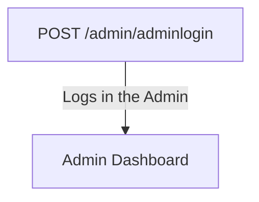

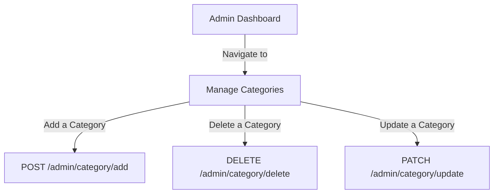

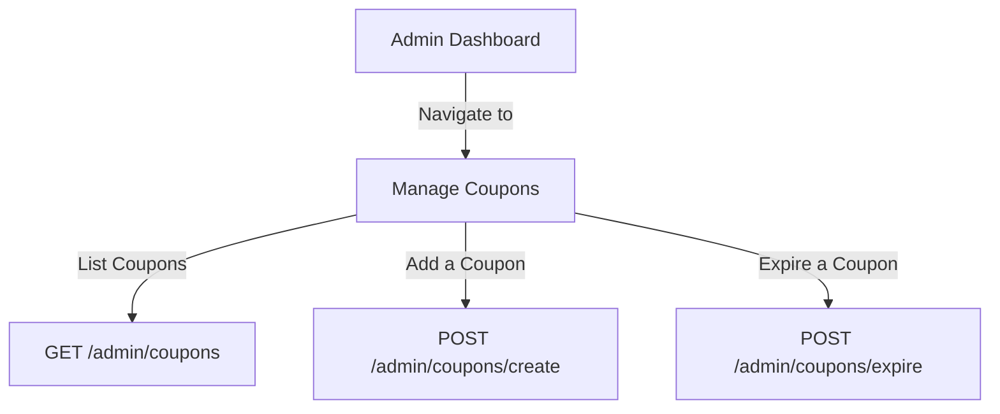

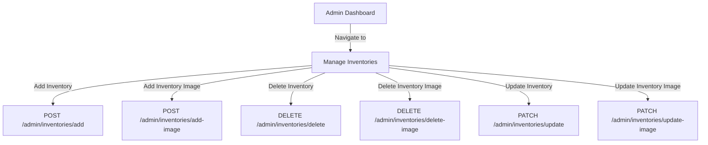

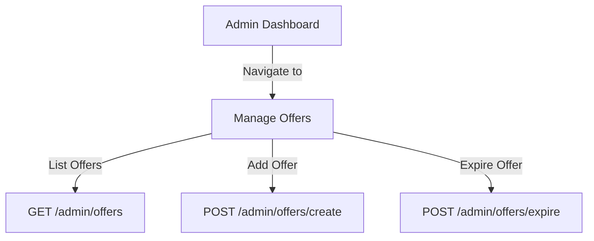

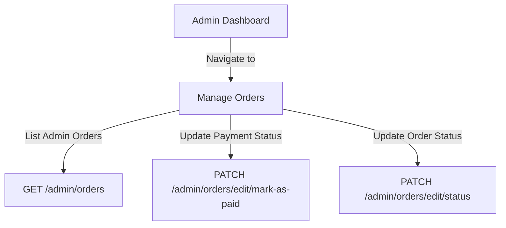

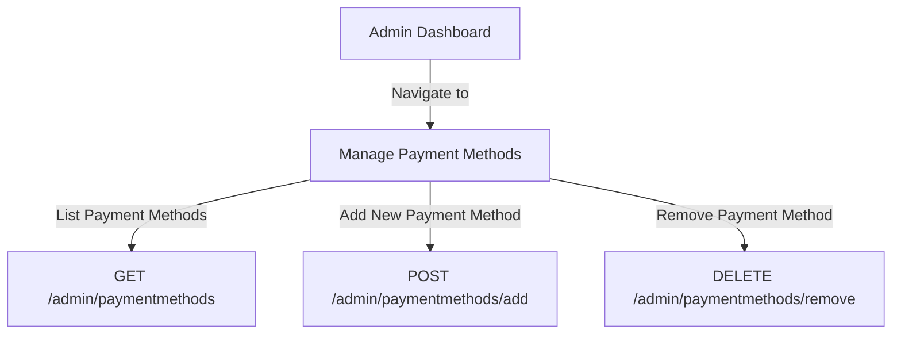

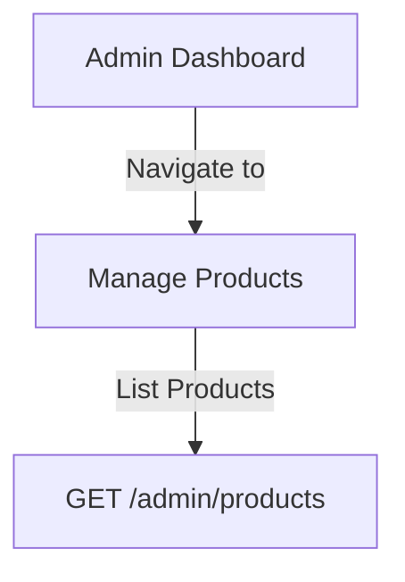

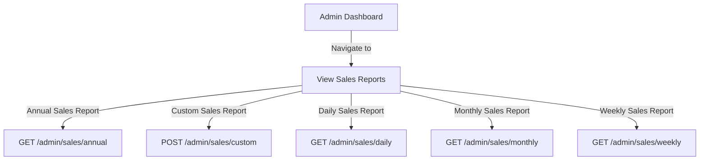

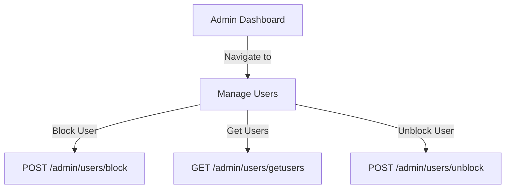


### User Endpoints

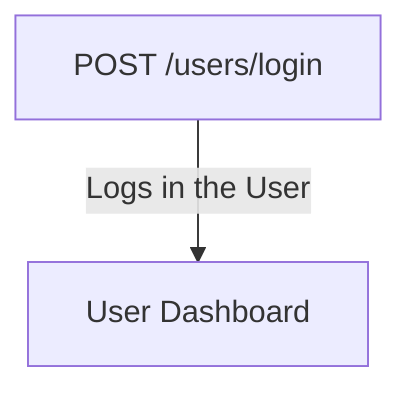
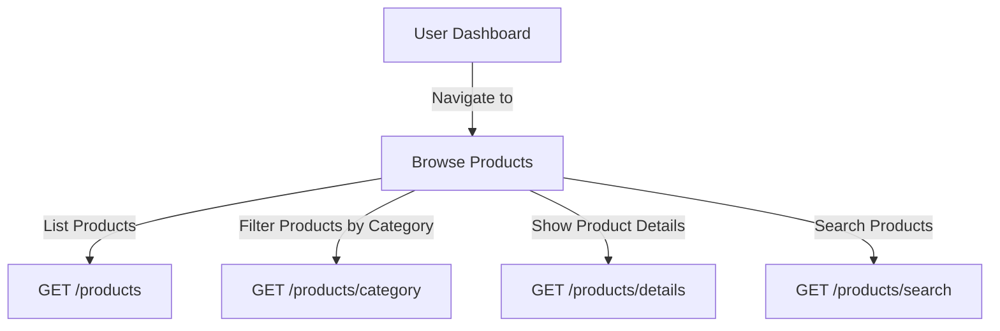

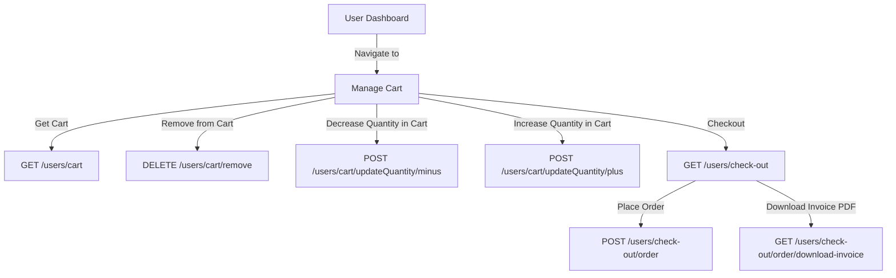

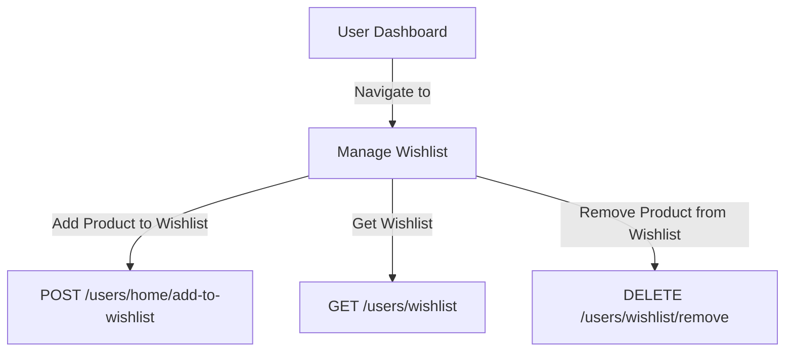

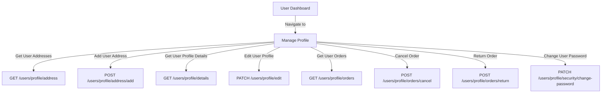

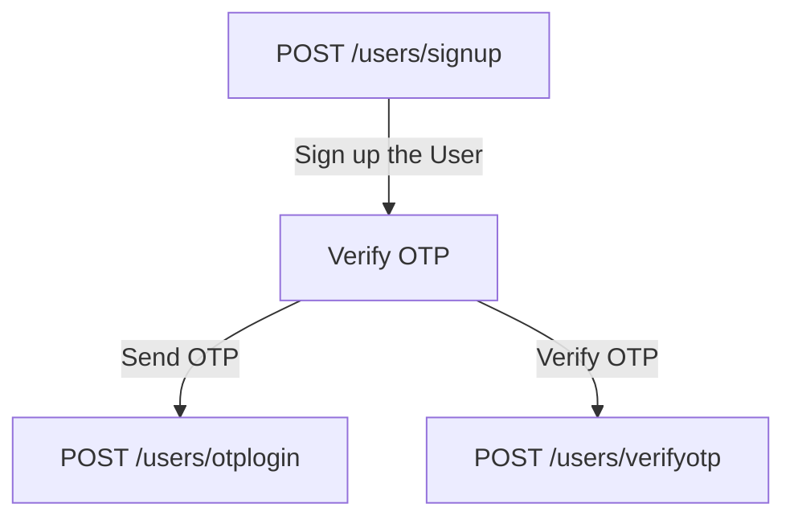

 
